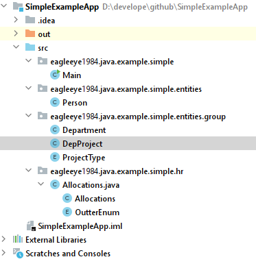
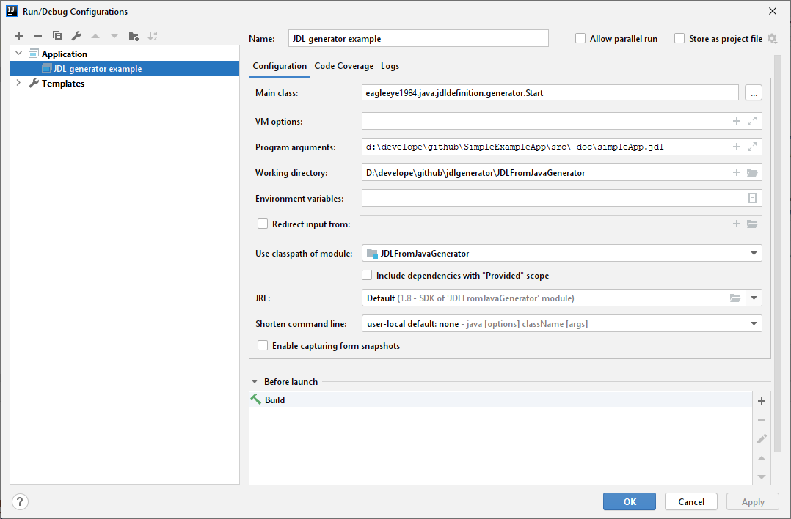
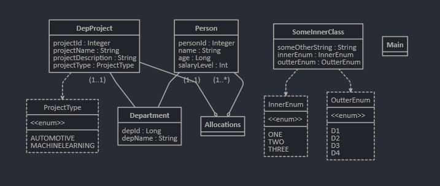

# Intro
This is simple application which creates JDL definition from existing Java 8 files - mostly the model of application or relations between classes, but not the logic. Maybe later it can be extended to gather some more then just entities relations.

The JDL definition file can be used with [JHipster](https://www.jhipster.tech/) development platform or with [JDL-Studio](https://start.jhipster.tech/jdl-studio/).

This application is not intended for any kind of piracy. This application is intended for cases when you want to:
 - migrate your application model to use [JHipster](https://www.jhipster.tech/) - for example to migrate your desktop application to web application using [Angular](https://angular.io/).
 - generate UML class diagram using [JDL-Studio](https://start.jhipster.tech/jdl-studio/) - for example to create documentation or analysis

# Input parameters
The application takes 2 input parameters (* mandatory):
1. **Folder path or file name***
2. Output file name

## Folder path or file name
This is mandatory parameter.
This can be path to folder where are multiple *.java classes (include sub-folders) or one *.java file.

## Output file name
This parameter is optional and if given the JDL definition is written into given file. Otherwise, the JDL is printed to console only.

# Description
This application is really simple. It can be run from IntelliJ Idea and takes 2 input parameters.

To run this app from IntelliJ IDEA use Start.java as entry point (main class).

Application uses [ANTLR4](https://www.antlr.org/) and [Java8 grammar](https://github.com/antlr/codebuff/blob/master/grammars/org/antlr/codebuff/Java8.g4) to parse java classes.

# License
Feel free to use this base for any project you want.

# Handled structures
This tool should handle all primitive data types and simple collections.
List of structures tested:
* `String`
* `byte`
* `short`
* `int`
* `long`
* `float`
* `double`
* `char`
* `String`
* `boolean`
* `Byte`
* `Short`
* `Integer`
* `Long`
* `Float`
* `Double`
* `Boolean`
* `SomeInnerClass`
* `List<String>`
* `List<SomeInnerClass>`
* `List<Integer>`
* `Map<String, SomeDummyClass>`
* `Map<String, List<SomeDummyClass>>`
* `enum`
* Inner Class
* Enum in inner class

# Example
Below is example how to use this simple tool for getting JDL definition out of your existing java project.
For the example the dummy project with basic tree structure was used to demostrate what kind of java entities it can handle.

As development and run environment I used IntelliJ IDEA community edition.

List of steps to get JDL definition out of the existing project.

* Get this tool from GitHub
* Extract simple dummy java application
* Open the project in IntelliJ IDEA
* Prepare run configuration for simple example application

## Get project from GitHub
```
git clone https://github.com/eagleeye1984/jdlgenerator.git
```
## Extract simple dummy java application
There is example application zip [doc/SimpleExampleApp.zip](doc/SimpleExampleApp.zip). It can be simply extracted to any location on your disk.

The tree structure of the simple app is:<br>


## Prepare run configuration for simple example application
Run configuration should use `eagleeye1984.java.jdldefinition.generator.Start` as main class and location of simple java app extracted in previous step.

Input parameters are:
* root of the example project. In this case it is `d:\develope\github\SimpleExampleApp\src\`. You can use path to your model classes location, but make sure all dependencies are there otherwise the JDL will not be correct. So in this case it could be `d:\develope\github\SimpleExampleApp\src\eagleeye1984\java\example\simple\`.
* output file where the JDL definition will be written. In this case it is `doc\simpleApp.jdl`

Example of run configuration in IntelliJ IDEA:<br>


Run the application and you'll find the output in `doc/simpleApp.jdl` file. 

## Out file validation and usage
You should validate the [output file](doc/simpleApp.jdl) in [JDL-Studio](https://start.jhipster.tech/jdl-studio/) and if it is not correct, repair if contains any error or modify to your needs.

If everything is ok, you can use the UML diagram if this is your target or use the JDL to generate some app base of your needs with [JHipster](https://www.jhipster.tech/).
More info about how to use JDL definition can be found [here](https://www.jhipster.tech/jdl/getting-started).

UML diagram from example:



## Conlusion
This is just first version of the tool which was developed just for the need of UML diagram for my analysis so it is possible that there are some flaws, not supported structures or use-cases.
Feel free to use this base and amend it for your needs, or extend current tool and make it better and better.
Or you can contact me with your case and I can amend the tool with your use-case or repair any issue in the tool.

Hope this helps at least to one person with his task or create base for any project.
